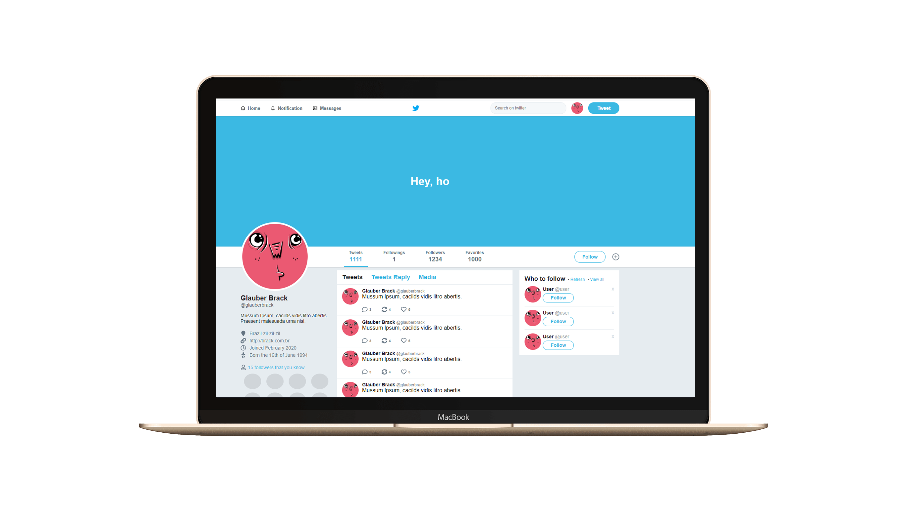

<h1 align="center">
    
</h1>

<h4 align="center">
   Talk to me
</h4>

 

  

## 💻 Project

Take a look at this great clone of twitter!

## :rocket: Techs

- [HTML]
- [CSS]
- [Flexbox]

---

☕ Glauber Brack - <a href="mailto:glauber@brack.com.br?Subject=Hello%20you">Mail me!</a> 
